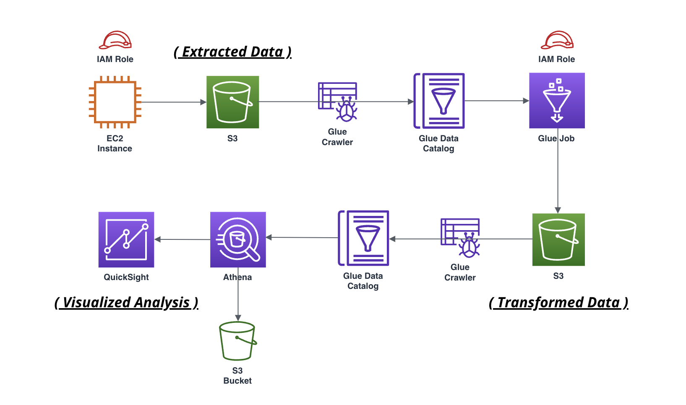

# Data Engineering Job Market Analysis
The project aimed to automate the extraction, transformation, and analysis of Data Engineering job listings from LinkedIn across Canada, the United States, the United Kingdom, and Australia. Utilizing a custom Scrapy Spider for extraction, ScrapeOps for deployment, AWS Glue for transformation, and Athena/QuickSight for analysis, it provided valuable insights into the Data Engineering job market trends across the four regions.

  

## ETL Pipeline
- Extraction (Scrapy Spider): A custom Scrapy Spider was developed in Python to efficiently extract Data Engineering job listings for the mentioned regions from LinkedIn.
- Deployment (ScrapeOps): was utilized for scalable deployment of the Scrapy Spider and ensured reliable and efficient execution of the web scraping process.
- Transformation (AWS Glue): Glue's ETL jobs facilitated the cleaning and structuring of the data for further analysis.
- Storage (AWS S3): The extracted and transformed job data was securely stored in an Amazon S3 bucket.
- Analysis and Visualization (Athena/QuickSight): Athena was used for querying the job data stored in Amazon S3 and QuickSight was employed for creating interactive visualizations and dashboards to analyze job market trends across the four regions.

  

## Tools & Libraries
- Python
- Scrapy
- ScrapeOps
- AWS EC2
- AWS S3
- AWS Glue
- AWS Athena
- AWS QuickSight
