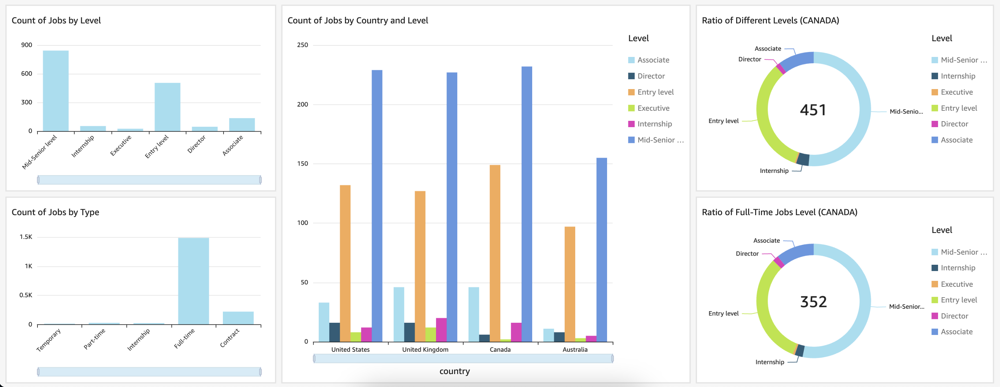

# Data Engineering Job Market Analysis
The project aimed to automate the extraction, transformation, and analysis of Data Engineering job listings from LinkedIn across Canada, the United States, the United Kingdom, and Australia. Utilizing a custom Scrapy Spider for extraction, ScrapeOps for deployment, AWS Glue for transformation, and Athena/QuickSight for analysis, it provided valuable insights into the Data Engineering job market trends across the four regions.

  

## ETL Pipeline
- Extract: It is initiated by leveraging web scraping capabilities through Requests and BeautifulSoup to extract market capital data from an archived Wikipedia page. This phase involves retrieving specific information related to banks' market capital from the source.
- Transform: Following data extraction, the pipeline utilizes Pandas and numpy to transform the raw data according to a predefined CSV file. This transformation involves calculating market capital in other currencies based on predefined conversion rates.
- Load: Once the data has been successfully transformed, the final step involves loading it into both a CSV file and an SQLite database. This is facilitated by incorporating SQLite for database management.
- Apache Airflow orchestrates these tasks, ensuring a systematic and automated execution of the entire ETL process.

  

## Tools & Libraries
- Python
- Scrapy
- ScrapeOps
- AWS EC2
- AWS S3
- AWS Glue
- AWS Athena
- AWS QuickSight
